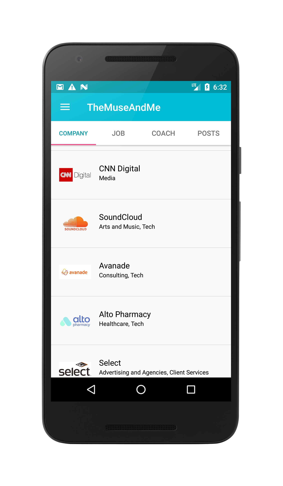
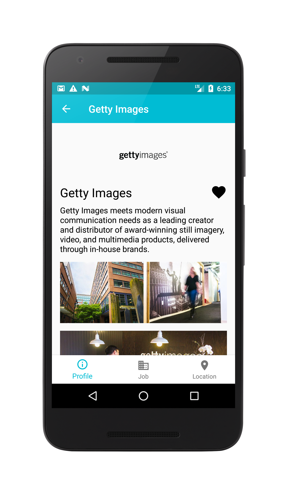
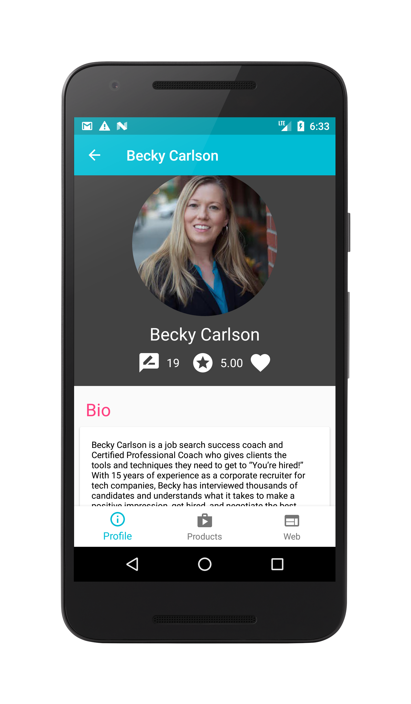
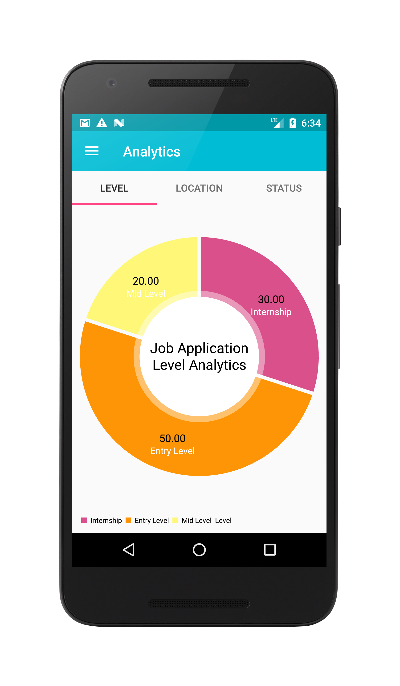
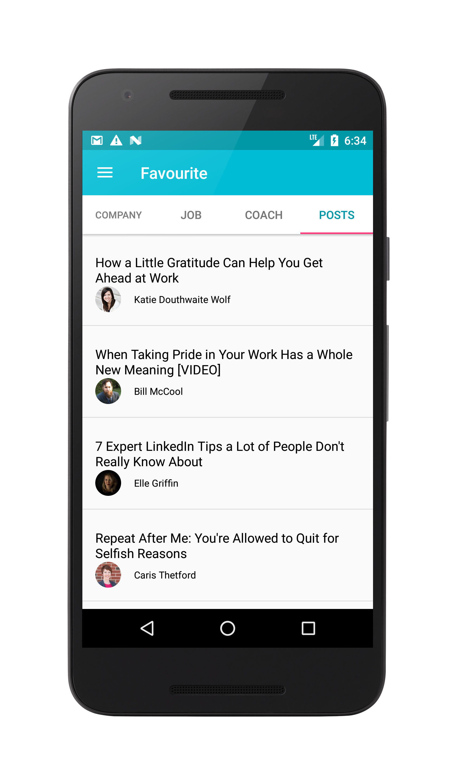
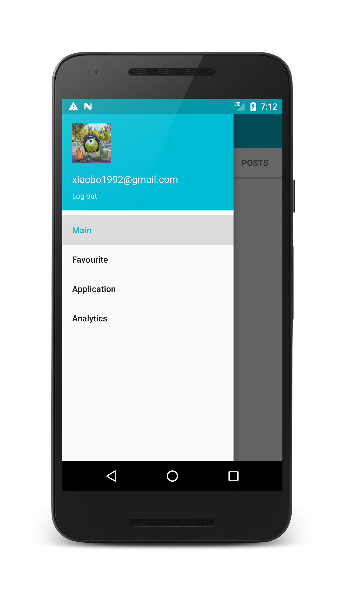

# TheMuseAndMe
## Description
TheMuseAndMe is a client Android app which allowed the user to find the job information such as company, jobs, coach, and post through [theMuse API](https://www.themuse.com/developers/api/v2). 

## Features
* Viewing the list jobs, companies, coach and posts
* Viewing the profile about company, job, coach and post
* Using Google Map to show the company location
* Storing the favourite jobs, companies, coach, and posts
* Recording applied jobs information such as status, date, and position
* Analyzing the applied jobs data, such as job level, location, and status

## Tech stack
* Firebase (Used for third party login and storing favourite information)
* REST API 
* Google Map 
* Android Library
  - OkHttp
  - Picasso
  - Gson
  - JazzyViewPager
  - ButterKife
  - fresco
  
  
  
  
  
  
  
## Screenshot

## Next
* Add search function
* Add filter function
